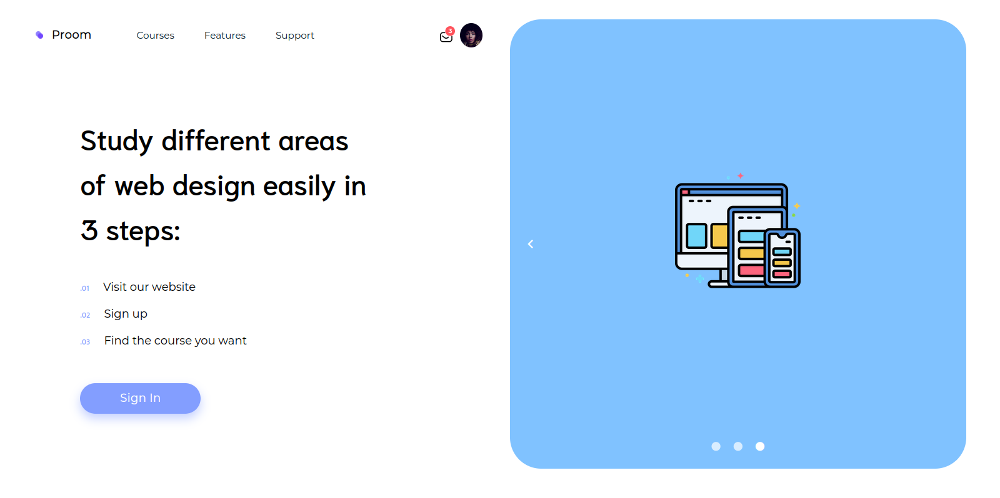

# Proom Web Design Courses (proom)

Proom is your all in one solution for accessing any and all courses on web design.

Access proom through the link here: https://proom-alg.netlify.app/#/

# To setup this project on your local machine, do the following:

## Install the dependencies
```bash
yarn
```

### Start the app in development mode (hot-code reloading, error reporting, etc.)
```bash
quasar dev
```

### Lint the files
```bash
yarn run lint
```

### Build the app for production
```bash
quasar build
```

## Screenshots of the Final Project

### Proom Home Page - First Carousel Item


### Proom Home Page - Second Carousel Item


### Proom Home Page - Third Carousel Item


### Proom Home Page - Mobile Responsive


### Proom Home Page - iPad

